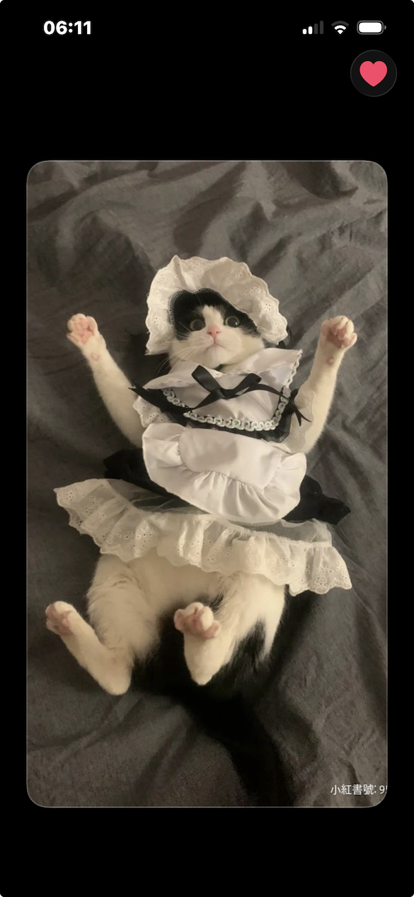
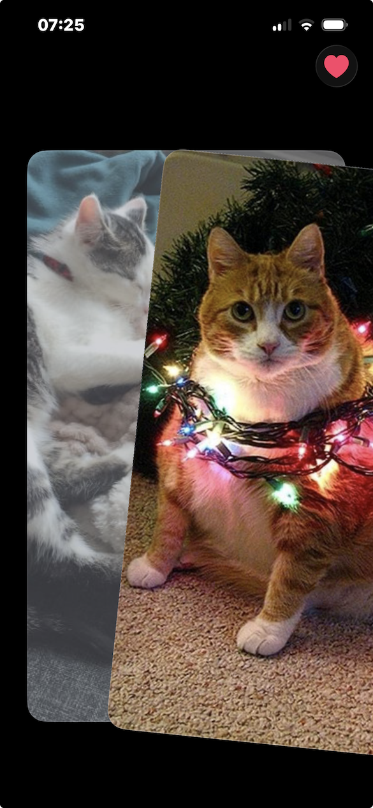
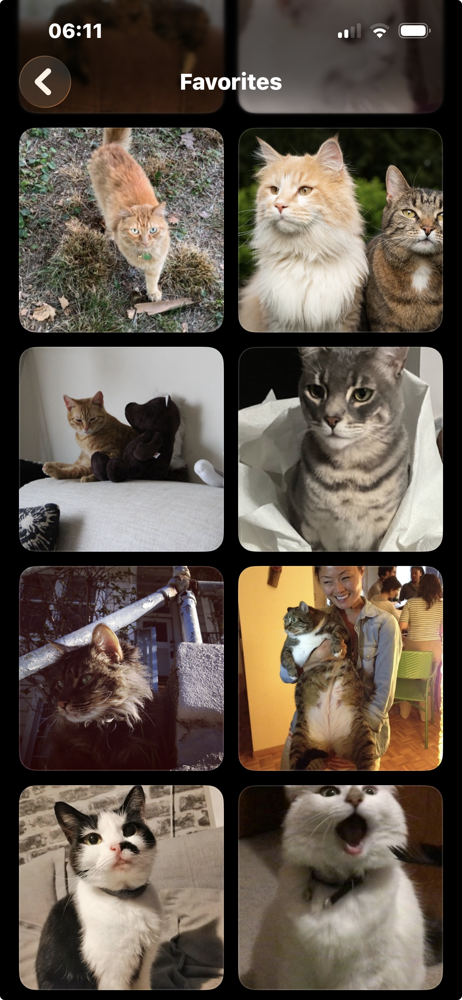

# CatFinderSwipe

## Swipe through random cats. Save your favourites, Share the best ones!

CatFinderSwipe is every cat lovers dream! built to be simple, fun and easy to use.

- **Swipe right** → Like and add to **Favourites**
- **Swipe left** → Skip
- **Favourites** View and share from Favourites
- Everything is saved **on your phone** (no account, no analytics)

---

## Screenshots (placeholders)

> Add your images into `/img/` and replace these files.

| What | Placeholder |
|---|---|
| Swiping |  |
| Favourites grid |  |
| Cat detail + Share |  |

---

## What you need

- A **Mac** with **Xcode** installed (get it from the Mac App Store)
- An **iPhone** (or iPad) with a recent iOS version
- An **Apple ID** (free is fine)

> You do **not** need to pay for the Apple Developer Program to install this on your own phone, but free installs can expire after a few days. If that happens, you just plug your phone in and press **Run** again.

---

## Install on your iPhone (step by step)

### 1) Download the project

**Easiest way (no Terminal):**

1. On GitHub, click **Code** → **Download ZIP**
2. Double-click the ZIP to unzip it
3. You’ll get a folder called **CatFinderSwipe**

---

### 2) Open it in Xcode

1. Open the folder
2. Double-click **CatFinderSwipe.xcodeproj**

---

### 3) Plug in your iPhone

1. Connect your iPhone to the Mac with a USB cable
2. Unlock your iPhone
3. If it asks, tap **Trust This Computer**

---

### 4) Pick your iPhone in Xcode

At the top of Xcode, choose your iPhone as the run destination (not “Any iOS Device”).

---

### 5) Set up signing (first time only)

1. In Xcode, click the blue project icon (left side)
2. Select **Targets** → **CatFinderSwipe**
3. Open **Signing & Capabilities**
4. Tick **Automatically manage signing**
5. Choose your **Team** (your Apple ID)
6. If Xcode shows a **Fix Issue** button, click it

---

### 6) Turn on Developer Mode (iOS 16+)

On your iPhone:

1. **Settings** → **Privacy & Security**
2. **Developer Mode** → **On**
3. Restart when it asks

---

### 7) Install and run

In Xcode, press the **Run** button (▶) or press **⌘R**.

Xcode will build the app and install it on your phone. You’ll see the app icon on your Home Screen.

---

### 8) If your phone asks to trust the developer

On your iPhone:

- **Settings** → **General** → **VPN & Device Management**
- Tap your Apple ID and choose **Trust**

---

## Using the app

1. Open **CatFinderSwipe**
2. Swipe:
   - **Right** to favourite
   - **Left** to skip
3. Go to **Favourites** to browse and share your saved cats

---

## Troubleshooting

### “Signing for ‘CatFinderSwipe’ requires a development team”

Go back to **Step 5** and make sure:

- **Automatically manage signing** is on
- Your **Team** is selected

### Your iPhone doesn’t appear in Xcode

- Unlock your iPhone and tap **Trust**
- Try a different USB cable/port
- In Xcode: **Window** → **Devices and Simulators** and check it’s listed

### “Developer Mode” isn’t there

- Your iPhone may be on an older iOS version (that’s okay), or it’s managed by work/school restrictions
- Update iOS if you can

### The app shows no cats / errors

CatFinderSwipe loads cat photos from:

- `https://cataas.com/`

Check:

- Your phone has internet
- Your Wi-Fi isn’t blocking that site

### The app stops opening after a few days (free Apple ID)

That’s normal. Plug your phone in and press **Run (⌘R)** again in Xcode.

---

## Privacy

- Cat photos are downloaded from **cataas.com**
- Favourites and “seen” history are stored **locally on your device** using SwiftData
- No login, no tracking, no third-party SDKs

---

## Developer notes (optional)

- DocC documentation: `CatFinderSwipe/Documentation.docc`
- Device test script: `bash scripts/test_on_device.sh`
